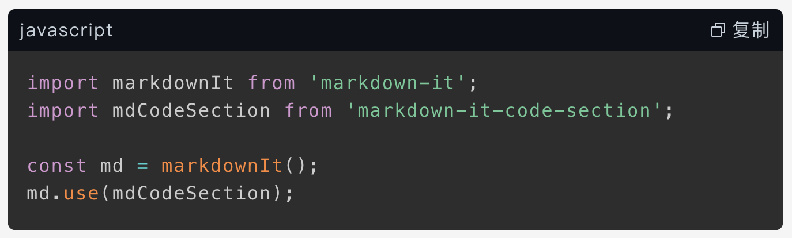

# markdown-it-code-section

Code plugin for [markdown-it](https://github.com/markdown-it/markdown-it)



## Install

```shell
npm install markdown-it-code-section
```

## Usage

```js
import markdownIt from 'markdown-it';
import mdCodeSection from 'markdown-it-code-section';
import 'markdown-it-code-section/dist/styles.css';
import 'prismjs/themes/prism-dark.min.css';

const md = markdownIt();
md.use(mdCodeSection);
// language
mdCodeSection.setLanguage({
  copy: '复制',
  copied: '已复制！'
})

const html = md.render(/* ... */);
```

### Load custom languages
See [prismjs](https://prismjs.com/)

```javascript
import loadLanguages from 'prismjs/components/index';

loadLanguages([
  'c',
  'objectivec',
  'xml',
]);
```
### Style
```js
import 'markdown-it-code-section/dist/styles.css';
import 'prismjs/themes/prism-dark.min.css'
```

If you wish to override titlebar & background styles
```css
:root {
  --md-code-section-text: #c9d1d9;
  --md-code-section-bg: #0d1117;
  --md-code-section-title: #c9d1d9;
}
```

## License
See [LICENSE](./LICENSE)
